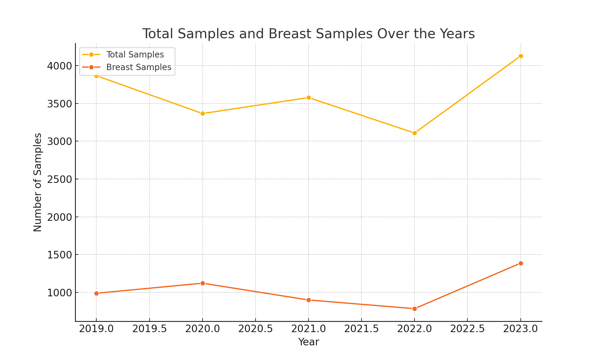
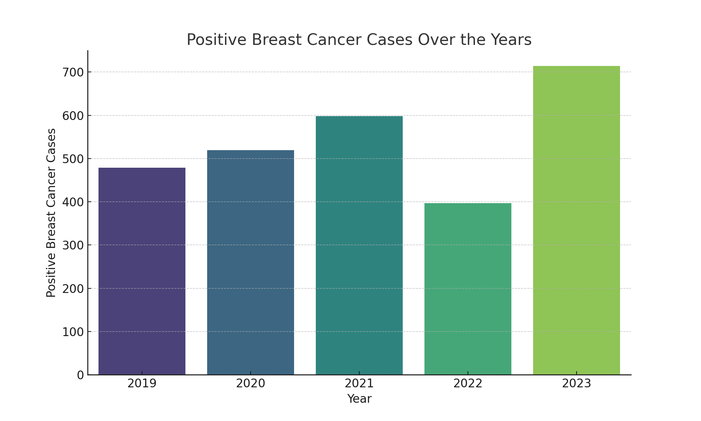

# Breast Cancer Data Analysis

This project analyzes breast cancer diagnosis data from the Histopathology Laboratory of National Hospital Abuja over the past five years.

## Project Structure
- `data`: Contains the raw data file `breast_cancer_data.csv`.
- `scripts`: Contains the Python script `data_analysis.py` for data analysis.
- `results`: Contains generated plots and analysis results.
- `.gitignore`: Specifies intentionally untracked files to ignore.

## Data Source
National Hospital Abuja Histopathology department hospital records.

## Analysis
The analysis includes:
- Descriptive statistics of the data.
- Visualizations showing trends in total samples, breast samples, and positive breast cancer cases over the years.

## Statistical Analysis
The correlation between Total Breast Samples and Positive Breast Cancers is calculated using Pearson correlation.

**Results:**
- Correlation: `0.98`
- P-value: `0.01`

**Conclusion:**

- Overall, these results suggest a strong and statistically significant relationship between the total breast samples collected and the number of positive breast cancer cases. This could imply that increased screening or sampling may lead to higher detection rates of positive cases, which may be a point of interest for further research or public health discussions. 

## Visualizations

### Total Samples and Breast Samples Over the Years

### Positive Breast Cancer Cases Over the Years

## How to Run the Analysis
1. Clone this repository.
2. Navigate to the `scripts` directory.
3. Run `data_analysis.py` to generate the analysis and plots.
